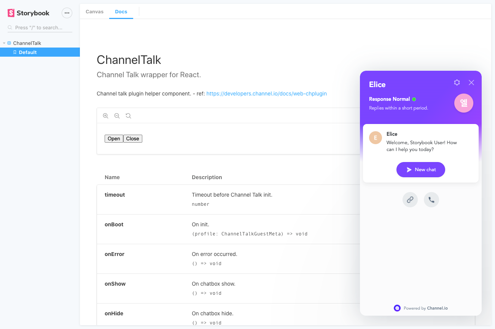

# React Channel Talk


[Channel Talk](https://channel.io) wrapper for React.



## Installation

#### Installation via NPM

```bash
$ yarn add react-channel-talk
```

## Getting started

Example code of react Channel Talk. See [Options](#options) and [APIs](#apis) for more details.

```jsx
import React from 'react';
import { ChannelTalk } from 'react-channel-talk';
import config from './config';

const App = () => {
  const user = useAppUser();

  const onTalkError = React.useCallback(err => {
    console.error('Error:', err);
  }, []);

  return (
    <>
      <button onClick={() => ChannelTalk.show()}>
        <span>Open</span>
      </button>

      <ChannelTalk
        pluginKey={config.channelTalk.key}
        locale="en"
        userId={user.id}
        profile={user.profile}
        hideDefaultLauncher
        onError={onTalkError}
      />
    </>
  );
};
```

## Options

These are available configuration options for react Channel Talk.

```ts
interface ChannelTalkProps extends ChannelTalkPlugInSettings {
  /** Timeout before init Channel Talk plugin. */
  timeout?: number;

  /** On init. */
  onBoot?: (profile: ChannelTalkGuestMeta) => void;

  /** On error occurred. */
  onError?: () => void;

  /** On chatbox show. */
  onShow?: () => void;

  /** On chatbox hide. */
  onHide?: () => void;

  /** On `unreadCount` is changed. */
  onChangeBadge?: (unreadCount: number) => void;

  /** On user success to create a chat. */
  onCreateChat?: () => void;

  /**
   * On user success to change their profile in the settings page and chats.
   * `profile` is an object of the user's profile.
   */
  onChangeProfile?: (profile: ChannelTalkUserProfile) => void;

  /**
   * On user clicks redirect images or buttons.
   * We pass the redirect url to a function.
   */
  onClickRedirect?: (url: string) => void;
}

interface ChannelTalkPlugInSettings {
  /** Channel plugin's key */
  pluginKey: string;

  /** User id. */
  userId?: string | number;

  /**
   * Css selector for custom button.
   * Use it with `hideDefaultLauncher` set to `true`.
   */
  customLauncherSelector?: string;

  /** Flag to decide whether to hide the default button. */
  hideDefaultLauncher?: boolean;

  /** Set content on the top of messages on the chat view. */
  chatHeaderContent?: string;

  /**
   * Decide whether it shows a navigation bar on the chat view.
   * Default value is `false`.
   */
  hideNavigationBarOnChatView?: boolean;

  /**
   * Flag to decide whether to track default events or not.
   * Default value is `true` */
  enabledTrackDefaultEvent?: boolean;

  /**
   * Flag to decide whether to track UTM source and referrer or not.
   * Default value is `true`
   */
  enabledUtmSourceTrack?: boolean;

  /**
   * Flag to decide whether to enter a chat room when you click the button.
   * Default value is `false`
   */
  openChatDirectlyAsPossible?: boolean;

  /** Custom plugin button's z-index. */
  zIndex?: number;

  /**
   * Set default language.
   * Only (en, ko, ja) available.
   */
  locale?: ChannelTalkLocale;

  /**
   * Profile object contains user information.
   * If this property is present, it will be used when boot is get called
   */
  profile?: ChannelTalkUserProfile;
}
```

## APIs

##### ChannelTalk.show()

Open Channel Talk messenger.

##### ChannelTalk.openChat(chatId: string | number)

Open chatroom directly at Channel Talk messenger.

##### ChannelTalk.lounge()

Go to the lounge view.

##### ChannelTalk.hide()

Close Channel Talk messenger.

##### ChannelTalk.track(eventName: string, eventProperty: any)

Track an event for Channel Talk.

##### ChannelTalk.clearCallbacks()

Clear all registered callbacks of Channel Talk.

## Development

#### Run demo with storybook

```bash
$ yarn storybook
```

#### Build to commonjs and ES module

```bash
$ yarn start
```

## Issues

`react-channel-talk` is a light-weight wrapper of [Channel Talk JS SDK](https://developers.channel.io/docs/what-is-a-channel-plugin). Because of this, the issue you're having likely isn't a react-channel-talk issue, but an issue with Channel Talk service itself. So please check it again, before submit new issue.
