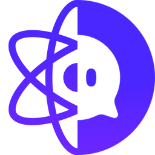

# react-channel-plugin


[](https://circleci.com/gh/ukjinjang/react-channel-plugin/?branch=master)
[](https://codecov.io/gh/ukjinjang/react-channel-plugin)
[](https://snyk.io/test/github/ukjinjang/react-channel-plugin)
[](https://bundlephobia.com/result?p=react-channel-plugin)
[](https://bundlephobia.com/result?p=react-channel-plugin)
[](https://bundlephobia.com/result?p=react-channel-plugin)


[Channel IO](https://channel.io) (Channel Talk) plugin wrapper for React.

## Installation

```bash
$ yarn add react-channel-plugin
```

## Getting started

Example code of react channel plugin.

```tsx
import React from 'react';
import {
  ReactChannelIO,
  useChannelIOApi,
  useChannelIOEvent,
} from 'react-channel-plugin';
import { CHANNEL_ID_PLUGIN_KEY } from './config';

const App = () => {
  return (
    <ReactChannelIO pluginKey={CHANNEL_ID_PLUGIN_KEY} locale="en" autoBoot>
      <AppPage />
    </ReactChannelIO>
  );
};

const AppPage = () => {
  const { showMessenger } = useChannelIOApi();

  useChannelIOEvent('onShowMessenger', () => {
    console.log('Messenger opened!');
  });

  return (
    <button onClick={showMessenger}>
      <span>Open</span>
    </button>
  );
};
```

## API

React provider and hooks for Channel IO API.

### ReactChannelIO

`<ReactChannelIO />` is [React Context provider](https://reactjs.org/docs/context.html#contextprovider), which will provides context (APIs and event listeners) to react-channel-plugin hooks. Also it receives Channel IO plugin options and initialize Channel IO instance. Make sure place `<ReactChannelIO />` upper than hooks used at your app.

#### Props

```tsx
/**
 * Please refer ChannelIO offical docs.
 * - ref: https://developers.channel.io/docs/web-boot-option
 */
type ChannelIOBootOption = {};

interface ReactChannelIOProps extends ChannelIOBootOption {
  /**
   * Indicates whether ChannelIO should be automatically booted or not.
   * If `true` no need to call `boot` manually.
   *
   * - Default: `false`
   */
  autoBoot?: boolean;

  /**
   * Timeout before call `boot`.
   * Only work when `autoBoot` set as `true`.
   *
   * - Default: `1000`
   */
  autoBootTimeout?: number;

  /**
   * Need to reboot channel plugin when boot option changed?
   *
   * - Default: `true`
   */
  rebootOnOptionChanged?: boolean;

  /**
   * Since ChannelIO does not support `customLauncherSelector` after plugin booted,
   * add onClick event listener at element which has `customLauncherSelector`
   * whenever DOM tree mutated. (observed by `MutationObserver`)
   *
   * - Default: `true`
   */
  useCustomLauncherSelectorTweak?: boolean;

  /**
   * Print debug logs via `console.debug`.
   * Set `false` when use plugin at production env.
   */
  verbose?: boolean;

  /**
   * Emitted when channel plugin booted.
   */
  onBoot?: (err?: any, user?: ChannelIOUser) => void;
}
```

#### Example

```tsx
import React from 'react';
import { ReactChannelIO } from 'react-channel-plugin';
import { CHANNEL_ID_PLUGIN_KEY } from './config';

const App = () => {
  const userProfile = { ... };

  return (
    <ReactChannelIO
      pluginKey={CHANNEL_ID_PLUGIN_KEY}
      hideChannelButtonOnBoot={true}
      locale="en"
      profile={userProfile}
      autoBoot
      autoBootTimeout={2000}
    >
      <span>Child component of the ReactChannelIO</span>
    </ReactChannelIO>
  );
};
```

### useChannelIOApi

Provides API of Channel IO as React hook. Please refer [official docs](https://developers.channel.io/docs/web-channel-io) to see detail description of each API.

- `boot`
- `shutdown`
- `showMessenger`
- ~~`show`~~ (will be deprecated)
- `hideMessenger`
- ~~`hide`~~ (will be deprecated)
- ~~`lounge`~~ (will be deprecated)
- `openChat`
- `track`
- `clearCallbacks`
- `updateUser`
- `addTags`
- `removeTags`
- `setPage`
- `resetPage`
- `showChannelButton`
- `hideChannelButton`

#### Example

```tsx
import { useChannelIOApi } from 'react-channel-plugin';

const AppPage = () => {
  const { showMessenger, updateUser } = useChannelIOApi();

  return (
    <>
      <button onClick={showMessenger}>
        <span>Open</span>
      </button>

      <button
        onClick={() => {
          updateUser({
            profile: {
              name: 'John Doe',
              email: 'john.doe@example.com',
              mobileNumber: '+821012345678',
            },
          });
        }}
      >
        <span>Update user</span>
      </button>
    </>
  );
};
```

### useChannelIOEvent

Provides event callbacks from Channel IO as React hook. Provide callback method name as first parameter of hook method. Please refer [official docs](https://developers.channel.io/docs/web-channel-io) to see detail description of each callback.

- ~~`onBoot`~~ (will be deprecated)
- `onShowMessenger`
- ~~`onShow`~~ (will be deprecated)
- `onHideMessenger`
- ~~`onHide`~~ (will be deprecated)
- `onBadgeChanged`
- ~~`onChangeBadge`~~ (will be deprecated)
- `onChatCreated`
- ~~`onCreateChat`~~ (will be deprecated)
- `onProfileChanged`
- ~~`onChangeProfile`~~ (will be deprecated)
- `onUrlClicked`
- ~~`onClickRedirect`~~ (will be deprecated)

#### Example

```tsx
import { useChannelIOApi } from 'react-channel-plugin';

const AppPage = () => {
  useChannelIOEvent('onShowMessenger', () => {
    console.log('Messenger opened!');
  });

  useChannelIOEvent('onChangeProfile', user => {
    console.log('User updated:', user);
  });

  return null;
};
```

## Pure APIs

You can use Channel IO API wrapper outside of React. Usage are same with [official API](https://developers.channel.io/docs/web-channel-io), but typed via TypeScript.

**WARNING: DO NOT USE with `<ReactChannelIO />`, because there is chance to overrides attached callbacks of react-channel-plugin and which will cause malfunctioning.**

```ts
import { ChannelIO } from 'react-channel-plugin';

ChannelIO('boot');

ChannelIO('onChatCreated', () => {
  console.log('User chat created!');
});
```

## Playground

Playground for react-channel-plugin.

[https://ukjinjang.github.io/react-channel-plugin](https://ukjinjang.github.io/react-channel-plugin)

## TypeScript

Please use typescript version higher than 3.8.

Thanks to awesome util [downlevel-dts](https://github.com/sandersn/downlevel-dts), we can convert d.ts file to use at older version of TypeScript even code using newer feature (like [Labeled Tuple Elements](https://www.typescriptlang.org/docs/handbook/release-notes/typescript-4-0.html#labeled-tuple-elements)).

## Unit Test

To run unit test components that use react-channel plugin's hook with [react-testing-library](https://testing-library.com/docs/react-testing-library/intro/), pass `ReactChannelIO` provider to [`wrapper`](https://testing-library.com/docs/react-testing-library/api#wrapper) option of [`render`](https://testing-library.com/docs/react-testing-library/api#render) method.

```tsx
import '@testing-library/jest-dom/extend-expect';
import { render } from '@testing-library/react';

// ...

render(<ComponentWithChannelHook {...props} />, {
  wrapper: ({ children }) => {
    return (
      <ReactChannelIO
        children={children}
        pluginKey={CHANNEL_ID_PLUGIN_KEY}
        {...pluginProps}
      />
    );
  },
});
```

## Brower compatibility

| Browser (last 2 versions) |      |
| ------------------------- | ---- |
| Google Chrome             | ✅   |
| MS Edge (Chromium)        | ✅   |
| Mozilla Firefox           | ✅   |
| Electron                  | ✅   |
| IE 11                     | ⚠️ † |

> † Since [Cypress not supports IE 11](https://docs.cypress.io/guides/guides/launching-browsers#Browsers), tested by hand (and may not fully tested).

### IE 11 support discontinued

Channel IO offically said via email, the support is gradually being discontinued. Contact to Channel IO for more information. This is extraction of their email contents:

> ### 인터넷 익스플로러(IE) 지원이 점차 중단됩니다.
>
> #### 지원중단 사유 
> - 마이크로소프트의 IE 지원 종료 선언 
> - 취약한 보안성, 느린 속도 등 안정적이지 않은 환경
>
> #### 단, IE를 계속해서 사용하셔도 불편 없도록 다음과 같이 적용합니다. 
> 1. 익스플로러 웹사이트에서 고객이 채팅버튼을 누르면, 채팅창은 엣지 Edge 브라우저로 열립니다.  (단, 윈도우7/8 에서는 > iframe 적용)
> 1. 고객이 다른 경로로 익스플로러에서 채팅창을 열게 되면, 레이아웃이 다소 깨져 보일 수 있어요.
> #### 고객을 놓치면 안되죠! 
> - 화면이 예쁘게 보이지 않더라도 고객과 정상적으로 채팅상담 가능하며, 이벤트 추적 등 핵심적인 기능은 모두 지원됩니다.
>
> #### 참고사항
> - 채널톡을 이용하시는 고객 중 인터넷 익스플로러 사용자 비중 약 3% 
> - 인터넷 익스플로러 최종 지원종료일은 2022년 6월 경으로 예정
>
> 💡 만약 핵심 고객군이 인터넷 익스플로러를 주로 사용하는 서비스라면, 미리 채널톡으로 문의 주세요.

## Issues

`react-channel-plugin` is a light-weight wrapper of [Channel IO JavaScript SDK](https://developers.channel.io/docs/web-installation). Because of this, the issue you're having likely isn't a react-channel-plugin issue, but an issue with Channel IO service itself. So please check it again, before submit new issue.
